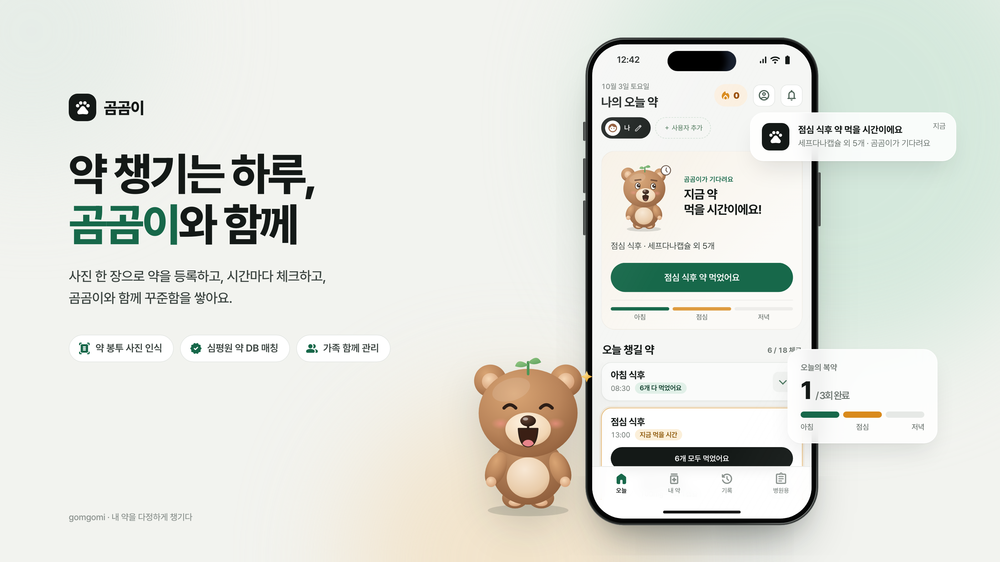
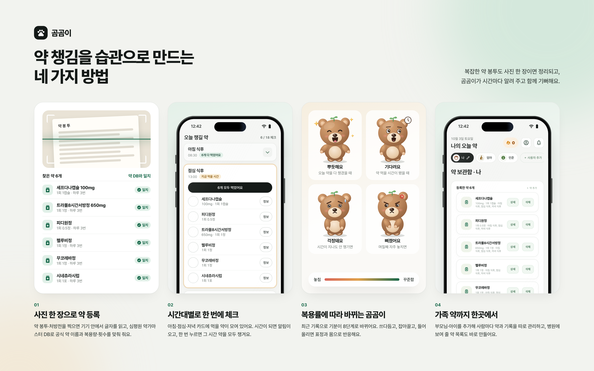

<div align="center">



# 곰곰이

**약 봉투 사진 한 장으로 시작하는 가족 복약 기록**

[](https://github.com/gimigyuhub/gomgomi-medication/actions/workflows/pages.yml)    

[웹앱 열기](https://gimigyuhub.github.io/gomgomi-medication/) · [설치와 배포](docs/setup.md) · [곰곰이 캐릭터](docs/character.md) · [OCR](docs/ocr.md)

</div>

<br>

## 주요 기능



| | 기능 | 설명 |
|:-:|---|---|
| 01 | **사진으로 약 등록** | PaddleOCR PP-OCRv5를 브라우저에서 실행해 약 봉투를 읽고, 심평원 약가마스터로 만든 약 DB(약 4.6만 품목)에서 공식 제품명과 1회 복용량·횟수를 찾아요. 사진은 기기 밖으로 나가지 않아요. |
| 02 | **시간대별 체크** | 아침·점심·저녁 카드에 오늘 먹을 약을 모아 보여 주고, 한 번 누르면 그 시간 약을 모두 챙겨요. 앱이 열려 있는 동안 복용 시간 알림을 보내요. |
| 03 | **곰곰이** | 복용 기록에 따라 8가지 기분으로 바뀌고, 쓰다듬기·잡아끌기·들어 올리기에 표정과 몸으로 반응하는 2D 리깅 캐릭터예요. 꾸준히 챙기면 새싹 → 꽃 → 별 → 왕관으로 자라요. |
| 04 | **가족 관리** | 한 Google 계정에서 여러 사람의 약 보관함과 복용 기록을 따로 관리하고, 병원에 보여 줄 약 목록을 만들어요. |

로그인하지 않아도 사진 인식과 의약품 정보 검색은 쓸 수 있고, 저장이 필요한 기능은 Google 로그인 후 열려요.

## 기술 구성

| 영역 | 사용 기술 |
|---|---|
| 화면 | HTML · CSS · 바닐라 JavaScript(ES 모듈), 설치형 웹앱(PWA) |
| 로그인 · 데이터 | Supabase Auth(Google) · Postgres + 행 단위 보안(RLS) |
| 사진 인식 | PaddleOCR PP-OCRv5 → onnxruntime-web(브라우저 실행), 대체 엔진 Tesseract.js |
| 약 이름 매칭 | 심평원 약가마스터 → Postgres 글자 조각 역색인 검색(`match_drugs`) |
| 의약품 정보 | medikr.kr API(e약은요) · 의약품안전나라 허가사항 링크 |
| 배포 | GitHub Actions → GitHub Pages |

## 폴더 구조

```
.
├── index.html                      앱 화면(HTML)
├── sw.js                           서비스 워커(오프라인 캐시·알림) — 범위 때문에 루트에 둠
├── manifest.webmanifest            설치형 웹앱 정보
├── src/
│   ├── app.js                      화면·데이터 흐름(로그인, 약 등록, 체크, 알림)
│   ├── styles.css                  화면 스타일
│   ├── bear.js                     곰곰이 캐릭터(뼈대·물리·얼굴 파라미터)
│   ├── game.js                     반응·축하 효과
│   ├── mood.js                     복용 상태 → 곰곰이 기분 규칙
│   ├── drug-name.js                공식 약 이름 → 이름·함량·성분
│   ├── ocr-paddle.js               브라우저 OCR(PP-OCRv5)
│   └── supabase-config.example.js  서버 설정 예시(실제 파일은 배포 때 생성, Git 제외)
├── assets/
│   ├── icons/                      앱 아이콘
│   └── models/ocr/                 OCR 모델(ONNX, 약 18MB)
├── supabase/
│   ├── schema.sql                  사용자 데이터 테이블 + RLS
│   └── drugs.sql                   약 DB 테이블·검색 함수
├── scripts/load-drugs.py           약가마스터 → 약 DB 적재
├── tests/                          기분 규칙 테스트
└── docs/                           설치·구조·OCR·캐릭터 문서, 목업 이미지
```

## 시작하기

```bash
cp src/supabase-config.example.js src/supabase-config.js   # Supabase URL과 publishable key 입력
npm start                                                 # http://localhost:5174
npm test                                                  # 기분 규칙 테스트
```

## 문서

| 문서 | 내용 |
|---|---|
| [설치와 배포](docs/setup.md) | Supabase 준비, Google 로그인, 약 DB 적재, 로컬 실행, GitHub Pages 배포 |
| [구조와 데이터](docs/architecture.md) | 테이블 구성, 권한(RLS), 개인정보 처리 |
| [OCR과 약 이름 매칭](docs/ocr.md) | 사진 보정 → 검출 → 인식 → 약 DB 매칭 단계와 정확도 |
| [곰곰이 캐릭터](docs/character.md) | 뼈대, 물리, 질량비, 만지기 반응, 얼굴 파라미터 |
| [곰곰이 표정 규칙](docs/mood-rules.md) | 복용 상태 → 8가지 기분 |
